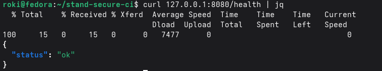
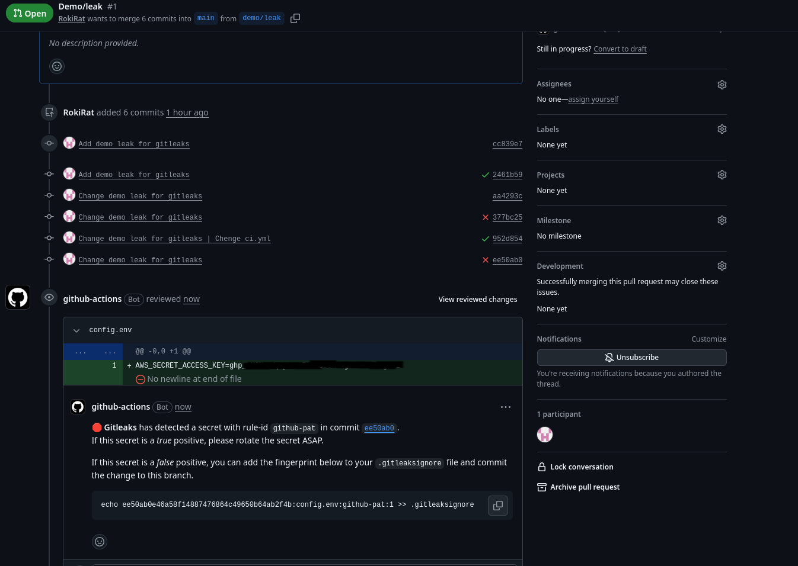
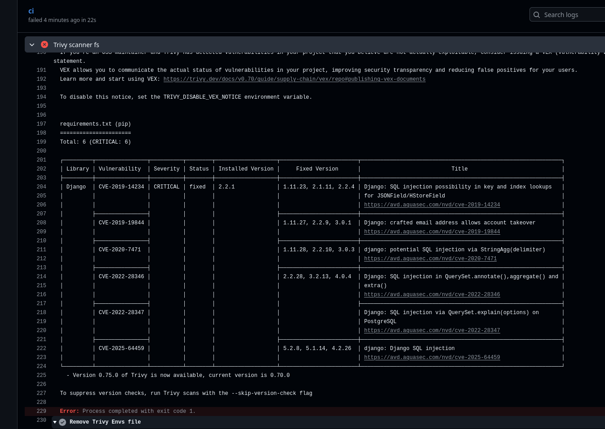
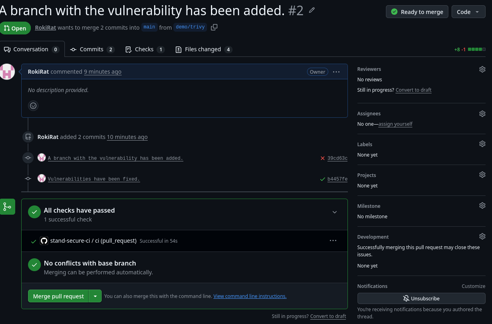

# stand-secure-ci

## Учебный стенд для позиции junior DevSecOps
1. Команда запуска `docker compose up -d --build`. Команда для провекрки юзера `docker-compose exec app id`

2. [Actions](https://github.com/RokiRat/stand-secure-ci/actions)

3. В [коммите](https://github.com/RokiRat/stand-secure-ci/commit/ee50ab0e46a58f14887476864c49650b64ab2f4b) был добавлен config.env с примером токена. 

Убрал данным [коммитом](https://github.com/RokiRat/stand-secure-ci/commit/3afa4875c41433b28291c53051ce6feeb30104f7)
Уронил PR Gitleaks, правило github-pat, прогон [37452140350](https://github.com/RokiRat/stand-secure-ci/actions/runs/37452140350). Файл удалён, но секрет остался в коммите ee50ab0, поэтому в .gitleaksignore один fingerprint, не всё правило. 

4. В ci.yml поставил Trivy fs и Trivy image, порог CRITICAL. [Прогон зелёный](https://github.com/RokiRat/stand-secure-ci/actions/runs/37471174889/job/112294753310). Был неудачный прогон из-за облегчённой версии убунту (Стояла ubuntu-slim). 

5. В ветку demo/trivy была запушена версия со списком уязвимых библиотек в requirements.txt и при [прогоне](https://github.com/RokiRat/stand-secure-ci/actions/runs/37481167783/job/112329343977) GitActions Trivy выдал список уязвимостей. 

После чего убрал список уязвимых библиотек и запушил чистую версию Trivy ругаться перестал, [прогон](https://github.com/RokiRat/stand-secure-ci/actions/runs/37482786634/job/112335000064) зелёный.
